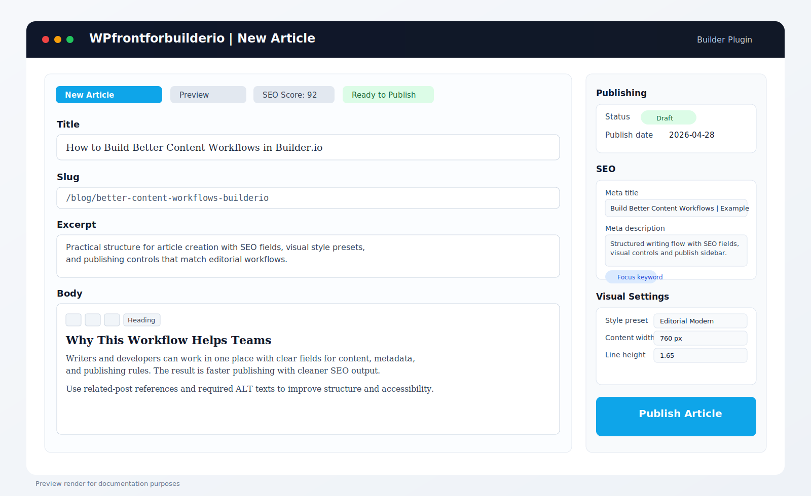

# WPfrontforbuilderio

Public Builder.io plugin that adds a WordPress-style **New Article** writing workflow with SEO-focused fields.

## Dashboard Preview



This preview shows the target WordPress-style writing layout, SEO panel, visual settings, and publishing sidebar.

## Features

- `New Article` main tab inside Builder editor
- WordPress-like writing layout (title, slug, excerpt, body)
- Visual writing controls (style preset, content width, font size, line height)
- SEO fields and readiness score
- Publishing sidebar (status, publish date, featured image, authors, tags)
- Required ALT text for images

## Plugin ID

`builder-new-article-public-plugin`

## Install in Builder from npm package

After publishing this package to npm, open Builder:

1. **Space Settings -> Plugins -> Edit**
2. Add npm package path:

```text
wpfrontforbuilderio
```

You can also pin a version:

```text
wpfrontforbuilderio@1.1.0
```

## Optional URL install (CDN)

If needed, you can still install via direct URL:

```text
https://unpkg.com/wpfrontforbuilderio@latest/dist/plugin.system.js?pluginId=builder-new-article-public-plugin
```

or with jsDelivr:

```text
https://cdn.jsdelivr.net/npm/wpfrontforbuilderio@latest/dist/plugin.system.js?pluginId=builder-new-article-public-plugin
```

## Publish to npm

From your local clone of this repository:

```bash
npm login
npm publish --access public
```

If the unscoped package name is already taken, switch to a scoped name in `package.json`, for example:

```json
"name": "@jannehalttu/wpfrontforbuilderio"
```

and publish with:

```bash
npm publish --access public
```

Then use this in Builder:

```text
@jannehalttu/wpfrontforbuilderio
```

## Recommended fields in your Builder Data Model

- `title`, `slug`, `excerpt`, `body`
- `featuredImage`, `featuredImageAlt`
- `publishDate`, `updatedDate`, `status`
- `authors`, `categories`, `tags`
- `seoTitle`, `metaDescription`, `focusKeyword`, `canonicalUrl`
- `robotsIndex`, `robotsFollow`
- `ogTitle`, `ogDescription`, `ogImage`
- `twitterCard`, `twitterTitle`, `twitterDescription`, `twitterImage`
- `defaultLocale`, `availableLocales`
- `stylePreset`, `contentWidth`, `fontSize`, `lineHeight`

## Local test

```bash
python -m http.server 9000
```

Then use:

```text
http://YOUR-IP:9000/dist/plugin.system.js?pluginId=builder-new-article-public-plugin
```